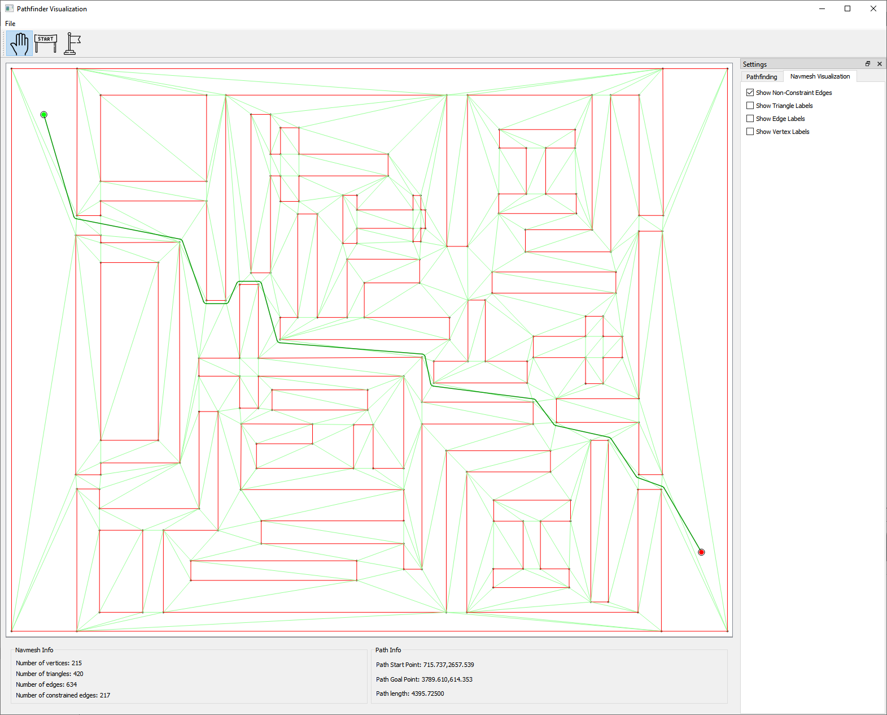

# Pathfinder Visualization

This is a desktop application that provides an interactive experience to play with and and develop on my [Pathfinder libary](https://github.com/SandSnip3r/Pathfinder). As a user, you can load some polygon data, move the start and goal points of the path around, and watch the path be computed in realtime.

  

## Getting Started

These instructions will help you to build this desktop application.

### Prerequisites

This project requires Qt, a C++ compiler, and CMake to be installed on your system.

### Building

1. Open this project in Qt Creator.

2. Configure a kit for your system/environment

3. Build

### Usage

Please see the [Wiki](https://github.com/SandSnip3r/Pathfinder-Visualizer/wiki) for details on the current functionality.

## Known Issues

- Zooming in too far leads to issues
- A user is allowed to move the start and goal points to invalid locations (such as overlapping with an object)
  - Note: This will result in weird path results. Read more in the [Pathfinder wiki(https://github.com/SandSnip3r/Pathfinder/wiki)
- A mouse click will not move the start/goal points, the mouse must be dragged while holding left click
- I don't know of a good way to initialize configuration values with the actual data that was initialized
- I've seen build issues on Windows where .PDB files are being accessed in parallel

_Note: Pathfinder issues are not listed here_

## Future Work

- Additional configuration parameters for the pathfinding algorithm
  - Such as heuristic weighting, optimal search, etc.
- Show why a path could not be found
- Display how long the path took to be built
- Show current cursor position
- As Pathfinder grows, this too will grow

## Contributing

Please read [CONTRIBUTING.md](./CONTRIBUTING.md) for details on the process for submitting pull requests to us.

## Authors

- Victor Stone - [LinkedIn](https://www.linkedin.com/in/sandsnip3r/)